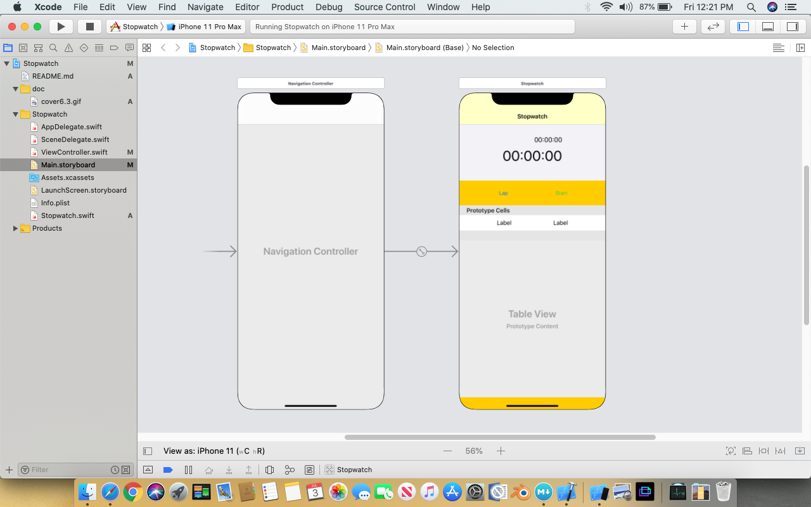
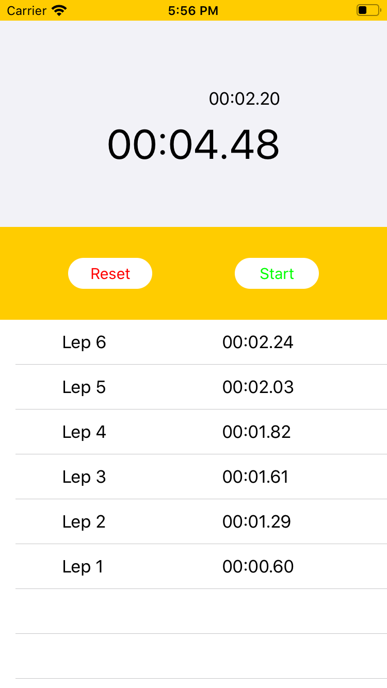

# Stopwatch


### What we wiil Learn
* Swift Timer
* TableView update according to creating new value
* Change Button Attribute on demand

Timer

for enabling a timer we need to call scheduledTimer() method of Timer, Timer will help us to create Time related activities say start or invalid it. That method will call a function over there we can count and display our desired times. (Note: Declaration function should be called by ViewDidLoad Method)

```swift
//MARK:- Timer 1
    var timer: Timer?
    var runCount = 0

Timer.scheduledTimer(withTimeInterval: 1.0, repeats: true) { timer in
            print("Timer 1 fired!")
            self.runCount += 1
            if self.runCount == 3 {
                timer.invalidate()
            }
        }
```

```swift
//MARK:- Timer 2
let timer = Timer.scheduledTimer(timeInterval: 1.0, target: self, selector: #selector(fireTimer), userInfo: nil, repeats: true)

 @objc func fireTimer(timer: Timer){
                runCount += 1
                mainTimeLabel.text = String(runCount)
                print("Timer 2 fired!")
    
              if self.runCount >= 3 {
                 print("Timer invalidate!")
                timer.invalidate()
					}
```

```swift
  //MARK:- Timer 3
        let context = ["user":"@Maruf", "location":"@Dhaka"]
        let timer = Timer.scheduledTimer(timeInterval: 1.0, target: self, selector: #selector(fireTimer3), userInfo: context, repeats: true)
        timer.tolerance = 0.2
        
    @objc func fireTimer3(timer: Timer){
                guard let context = timer.userInfo as? [String: String] else {return}
                let user = context["location", default: "Anonymous"]  Anonymous will print if user invalid
    
                runCount += 1
                mainTimeLabel.text = String(runCount)
                print("Timer 3 fired!", user)
    
              if self.runCount >= 3 {
                 print("Timer invalidate!")
                timer.invalidate()
              }
            }
     
```


```swift
    // MARK:- Timer 4
        let context = ["user": "@twostraws"]
        let timer = Timer(timeInterval: 1.0, target: self, selector: #selector(fireTimer4), userInfo: context, repeats: true)
        RunLoop.current.add(timer, forMode: .common)
    }
     @objc func fireTimer4(timer: Timer){
                guard let context = timer.userInfo as? [String: String] else {return}
                let user = context["user", default: "Anonymous"]  Anonymous will print if user invalid
    
                runCount += 1
                timerLabel.text = String(runCount)
                print("Timer 3 fired!", user)
    
              if self.runCount >= 50 {
                 print("Timer invalidate!")
                timer.invalidate()
              }
            }
    
```

### CADisplayLink for update Game Screen insted of Timer objects
it can return 120 loops per second

```swift
 //MARK:- Game Scree Update
        let displayLink = CADisplayLink(target: self, selector: #selector(update))
        displayLink.add(to: .current, forMode: .common)
    
     @objc func update() {
         print("Updating!")
     }
```
# lets started: Design



We create a single view application. on our story board we take two label under a new view, pin this view top of the layout & Make mainTimer Label horizontally and vertically center, and lapTimerLabel 10 px up of it with right align to the mainTimerLabel.

We take two button under a horizontal stackView, make it horizontally center and pin 10 from ther upper stack view.

Drag and drop a table view under the tableView under the stackView, put 10 distance between them and pin 3 remaining side to the view. Create a protype cell Named it lapCell. Take two label into a stackView into the cell content area & set this new stack center to the container Cell Content.

## Programs:
Step 1:<br>
We wiil create a swift file named Stopwatch, create a data model Stopwatch of NSObjct type including two data, Counter of type float and timer of Timer type and init its value.

```swift
import Foundation

class Stopwatch: NSObject {
  var counter: Double
  var timer: Timer
  
  override init() {
    counter = 0.0
    timer = Timer()
  }
}
```
Step 2: Initializaton
We will create some variable and outlet of our UI Components. We will nitializ initCircleButton Cluser and changeButton function 

```swift
   // MARK: - Variables
    var lap: [String] = []
    var isPlay: Bool = false
    var mainStopwatch: Stopwatch = Stopwatch()
    var lapStopwatch: Stopwatch = Stopwatch()
    
    // MARK: - UI components
    @IBOutlet weak var timerLabel: UILabel!
    @IBOutlet weak var lapTimerLabel: UILabel!
    @IBOutlet weak var playPushButton: UIButton!
    @IBOutlet weak var lapResetButton: UIButton!
    @IBOutlet weak var lapTableView: UITableView!
    
    let initCircleButton: (UIButton) -> Void = { button in
        button.layer.cornerRadius = 0.5 * button.bounds.size.height   
        button.backgroundColor = UIColor.white
    }
    
    //MARK: -Private Function
fileprivate func changeButton(_ button: UIButton, title: String, color: UIColor){
    button.setTitle(title, for: .normal)
    button.setTitleColor(color, for: .normal)
}

```
Step 3: On Load
Make our view controller subclass of UITableViewDelegate, UITableViewDataSource and set our lapTableView delegate and datasource to our view controller. Set table row height 44

```swift   
 override func viewDidLoad() {
        super.viewDidLoad()
        lapTableView.delegate = self
        lapTableView.dataSource = self
        lapTableView.rowHeight = 44
        lapResetButton.isEnabled = false
        initCircleButton(playPushButton)
        initCircleButton(lapResetButton)
    }   
```
Step 4: playPushButton on Pressed
Here we will initialized our timer using our dataModel, change some button attributes and call a functin to count the time by selector, before that we will create an extension of Selector, which will call OBJC function, under those OBJC function we will call updateTimer() method which will update our View.
If Timer already on running mode, here we will simply Push it but our can't not setup our counter to zero, so that we can restart it with its current value.

```swift
@IBAction func playPushButtonPressed(_ sender: Any){
        lapResetButton.isEnabled = true
        if !isPlay{
            unowned let weakSelf = self
                  mainStopwatch.timer = Timer.scheduledTimer(timeInterval: 0.035, target: weakSelf, selector: Selector.mainTimer, userInfo: nil, repeats: true)
            RunLoop.current.add(mainStopwatch.timer, forMode: .common)
                  
            lapStopwatch.timer = Timer.scheduledTimer(timeInterval: 0.035, target: weakSelf, selector: Selector.lapTimer, userInfo: nil, repeats: true)
            RunLoop.current.add(lapStopwatch.timer, forMode: .common)
            isPlay = true
            changeButton(playPushButton, title: "Stop", color: UIColor.red)
            changeButton(lapResetButton, title: "Lap", color: UIColor.black)
        }else{
            isPlay = false
            changeButton(playPushButton, title: "Start", color: UIColor.green)
            changeButton(lapResetButton, title: "Reset", color: UIColor.red)
            mainStopwatch.timer.invalidate()
            lapStopwatch.timer.invalidate()
        }
    }    

extension Selector {
        static let mainTimer = #selector(ViewController.updateMainTimer)
        static let lapTimer = #selector(ViewController.updateLapTimer)
    }    

   
@objc func updateMainTimer(){
        updateTimer(mainStopwatch, label: timerLabel)
    }
    @objc func updateLapTimer(){
        updateTimer(lapStopwatch, label: lapTimerLabel)
    }

```
updateTimer method will calculate minutes and second from its parameter stopwatch of Type Stopwatch and set it to label for each 0.035 second.

```swift

    func updateTimer(_ stopwatch: Stopwatch, label: UILabel){
        
            stopwatch.counter = stopwatch.counter + 0.035
            var minutes = String((Int)(stopwatch.counter / 60))
            if (Int)(stopwatch.counter / 60) < 10{
                minutes = "0\(minutes)"
            }
            var second = String(format: "%.2f", stopwatch.counter.truncatingRemainder(dividingBy: 60))
            if stopwatch.counter.truncatingRemainder(dividingBy: 60) < 10 {
                second = "0" + second
            }
            label.text = minutes + ":" + second
            //print(minutes + ":" + second)
            
        
    }  

```
Step 5: lapRestButton on Pressed
Here we will store our current timer counter value to an array and according to array value we will refresh our tableView and restart our lapTimer again.
On the other hand we will reset our Stopwatch Timer, counter, Labels and remove the data store in Array.

```swift
 @IBAction func lapRestButtonPressed(_ sender: Any) {
        if isPlay{
            if let currentTimerValue = timerLabel.text{
                lap.append(currentTimerValue)
            }
            resetLapTimer()
            
            unowned let weakSelf = self
            lapStopwatch.timer = Timer.scheduledTimer(timeInterval: 0.035, target: weakSelf, selector: Selector.lapTimer, userInfo: nil, repeats: true)
            RunLoop.current.add(lapStopwatch.timer, forMode: .common)
            lapTableView.reloadData()
            
        }else{
            changeButton(playPushButton, title: "Start", color: UIColor.green)
            changeButton(lapResetButton, title: "lap", color: UIColor.gray)
            lapResetButton.isEnabled = false
            resetMainTimer()
            resetLapTimer()
            
            lap.removeAll()
            lapTableView.reloadData()
        }
    }
    func resetMainTimer(){
        resetTimer(mainStopwatch, label: timerLabel)
    }
    func resetLapTimer(){
        resetTimer(lapStopwatch, label: lapTimerLabel)
    }
    func resetTimer(_ stopwatch: Stopwatch, label: UILabel){
        stopwatch.timer.invalidate()
        stopwatch.counter = 0
        label.text = "00:00:00"
    }
```
Step 6: Table View Reload according to Lapse
First of all we will return numberOfRowsInSection according to our array data and then we will assign this value to cell label and finally we will return the cell to view

```swift      
extension ViewController {
    func tableView(_ tableView: UITableView, numberOfRowsInSection section: Int) -> Int {
        return lap.count
       }
       
       func tableView(_ tableView: UITableView, cellForRowAt indexPath: IndexPath) -> UITableViewCell {
        let cell = tableView.dequeueReusableCell(withIdentifier: "lapCell", for: indexPath)
        let labelForLap = cell.viewWithTag(11) as? UILabel
        
        let labelForTime = cell.viewWithTag(12) as? UILabel
        let noOfIndex = lap.count
        let currentRows = indexPath.row   // Start from ZERO (0)
        labelForLap?.text = String("Lap \(noOfIndex - currentRows)")
        labelForTime?.text = lap[noOfIndex - currentRows - 1]
        //print(noOfIndex, currentRows)
        return cell
       }
}
```




>Check out the full course and more at 
[www.joyonlineschool.com](https:www.joyonlineschool.com/)


